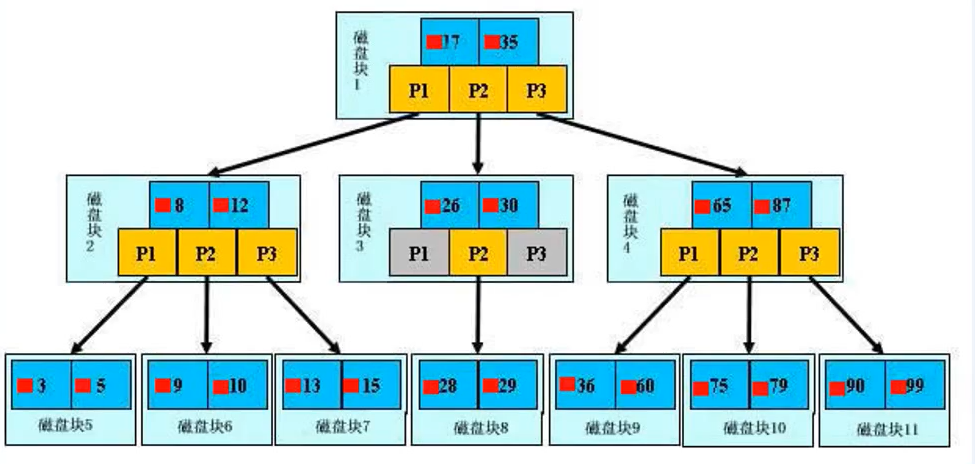

## 这里的数据库使用的是MySQL
## 学习数据库就是学习SQL语句的编写~

## 数据库client推荐使用vscode中的MySQL:
    挺好用的

## 登录命令:
    mysql -uroot -p123

## 概览
===================================================
数据库的增删改查:
    简称CRUD:create read update delete

## SQL 语句:
    SQL : structure query language 
    SQL 语句的分类:
        1. DDL(database define language)       定义 **数据库**/**表**
        2. DML(database manipulation language) 操作的是**数据**
        3. DCL(database control language)      控制的是 **权限** 相关
        4. DQL(database query language)        查询的是**数据** 

## SQL 语句
### DDL: create,drop,alter 数据库/表
#### ==============database===============
    1. 创建数据库
    create database 数据库名;

    2. 删除数据库
    drop database 数据库名;

    3. 修改数据库的编码 （一般很少修改数据库 , 如果修改，只会修改数据库的编码）
    alter database 数据库名 character set gbk;
    alter database 数据库名 character set utf8;

    相关命令:
        show databases;                      显示所有的数据库
        show create database 数据库名;       显示创建该数据库的语句
        use 数据库名;                        使用某个数据库

#### ==============table===============
    1. 创建表
    create table 表名(
        colname coltype(length) [constraint],
        colname coltype(length) [constraint],
        )
    常见的字段类型:
        数字类型:
            int 
            float 
            double
        字符类型:
            char    固定长度,(长度不够,会补空格)
            varchar 可变长度  
        日期类型:
            date 2021-04-25
            time 21:23:30 
            datetime 2021-04-25 21:23:30 

    2. 删除表 
    drop table 表名;

    3. 修改表 
    修改表名(比较少用)
        alter table 表名 to 新表名

    添加列 
        alter table 表名  add colname coltype(length) [constraint]; 

    修改列名
        alter table 表名 change old_colname new_colname col_type(length) [constraint];

    修改列的类型长度及约束 
        alter table 表名 modify colname new_coltype(new_length) [new_constraint]; 
    
    删除列 
        alter table 表名 drop colname;
    

    相关命令:
        show create table 表名;    显示建表语句
        show tables;               显示当前数据库下的所有表
        desc 表名;                 显示具体某个表的结构
       
    约束相关:
        主键约束 primary key 该列唯一 该列非空
        唯一约束 unique      该列唯一 该列可以为空 
        非空约束 not null    该列非空 
        
        
### DML: insert,delete,update 表中的数据
    1. 增加 表中数据
        insert into 表名(colname1,colname2) values(val1,val2);部分列即可 
        insert into 表名 values(val1,val2,val3);              所有列的值都要有 

    2. 删除 表中数据
        delete from 表名 [where 条件]; 如果没有条件就会删完整张表的数据

    3. 修改 表中数据
        update 表名  set 字段名=值,字段名=值 [where 条件];如果没有条件就会删完整张表的数据

### DQL: select 表中的数据
#### 查询语句的执行顺序
    select 列名 from  表名 where 条件 group by 分组 having 条件 order by 字段 limit;
    执行顺序:
        1 from 
        2 where 
        3 group by 
        4 having 
        5 select 
        6 order by
        7 limit

#### 单表查询

    select [distinct]*[列名,列名] from 表名 [where 条件][order by][group by][limit];
    1. 简单查询 
        select [distinct]*[列名,列名] from 表名;
        例子：
            1.查询所有的商品.    select * from product;
            2.查询商品名和商品价格. select pname,price from product;
            3.别名查询.使用的关键字是as.as可以省略的.
              3.1表别名:   select * from product as p;
              3.2列别名：select pname as pn from product;
            4.去掉重复值.  select distinct price from product;
    2. 条件查询 
        where 条件中常用的操作符:
            关系运算符: > >= < <= <>
            逻辑运算符: and or not 
            其他运算符: 
                is null : 专门判断是null 。        错误的方法: where aa == null
                is not null : 专门判断是not null 。错误的方法: where aa <> null
                between and : 在区间 where price between 100 and 1000; 100-1000之间
                in : 在里面       where id in (1,2,3,5,8)
                like: 模糊查询:
                    - : 代表一个字符          -> RE 中的 .
                    % : 代表人任意个数的字符  -> RE 中的 *
                    select * from product where pname like '*新*';商品名字带有新的所有商品

    3. 排序查询
        asc  ->  up  默认就是升序
        desc ->  down 
        select * from 表名 order by 列名 asc|desc;
            select * from product order by price;   商品按价格升序
            select * from product order by price desc;   商品按价格升序

    4. 聚合查询
        sum() avg() max() min() count();
        select 操作函数(列名) from 表名;
            select sum(price) from product;

    5. 分组查询
        select 列名1,操作函数(列名2) from product group by 列名1;
            select supplier_id,avg(price) from product gropu by supplier_id;

        having 在group by完成后,再次过滤
        select 列名1,操作函数(列名2) from product group by 列名1 having 条件;
            select supplier_id,avg(price) as p from product gropu by supplier_id having p>100;

    6. 分页查询
        limit  
        select * from 表名 limit offset,number;
            offset: 跳过前面多少行
            number: 返回后面多少行
            select * from product limit 3,3;
   
#### 多表查询
##### 多个表之间的关系如何维护？
    使用外键约束 foreign key(从表中添加外键约束,约束的是从表中的数据)
    Author - AuthorInfo 的关系 :o2o
    Author - Book       的关系 :o2m
    Book   - Press      的关系 :m2m

##### 创建多个表,并构建三种表关系
-- 创建表  
create table Author(
    id int primary key auto_increment,
    name varchar(10)
    );

create table AuthorInfo(
    id int primary key auto_increment,
    addr varchar(10),
    author_id int unique,
    foreign key(author_id) references Author(id)
    );

create table Book(
    id int primary key auto_increment,
    title varchar(10),
    author_id int,
    foreign key(author_id) references Author(id)
    );

create table Press(
    id int primary key auto_increment,
    name varchar(10)
    );

create table BookPress(
    id int primary key auto_increment,
    book_id int,
    press_id int,
    foreign key(book_id) references Book(id),
    foreign key(press_id) references Press(id)
    );

-- 准备数据 Author 
insert into author(name) values("张三01");
insert into author(name) values("张三02");
insert into author(name) values("张三03");
insert into author(name) values("张三04");
insert into author(name) values("张三05");
insert into author(name) values("张三06");
insert into author(name) values("张三07");
insert into author(name) values("张三08");

-- 准备数据 Author 
insert into authorinfo(addr,author_id) values("nc01",1);
insert into authorinfo(addr,author_id) values("nc02",2);
insert into authorinfo(addr,author_id) values("nc03",3);
insert into authorinfo(addr,author_id) values("nc04",4);
insert into authorinfo(addr,author_id) values("nc05",5);
insert into authorinfo(addr,author_id) values("nc06",6);
insert into authorinfo(addr,author_id) values("nc07",7);
insert into authorinfo(addr,author_id) values("nc08",8);

-- 准备数据 Book
insert into book(title,author_id) values("钢铁是怎样炼成的01",1);
insert into book(title,author_id) values("钢铁是怎样炼成的02",2);
insert into book(title,author_id) values("钢铁是怎样炼成的03",3);
insert into book(title,author_id) values("钢铁是怎样炼成的04",4);
insert into book(title,author_id) values("钢铁是怎样炼成的05",5);
insert into book(title,author_id) values("钢铁是怎样炼成的06",6);
insert into book(title,author_id) values("钢铁是怎样炼成的07",7);
insert into book(title,author_id) values("钢铁是怎样炼成的08",8);
insert into book(title,author_id) values("钢铁是怎样炼成的09",1);
insert into book(title,author_id) values("钢铁是怎样炼成的10",1);
insert into book(title,author_id) values("钢铁是怎样炼成的11",2);
insert into book(title,author_id) values("钢铁是怎样炼成的12",3);
insert into book(title,author_id) values("钢铁是怎样炼成的13",5);
insert into book(title,author_id) values("钢铁是怎样炼成的14",7);
insert into book(title,author_id) values("钢铁是怎样炼成的15",7);
insert into book(title,author_id) values("钢铁是怎样炼成的16",8);

-- 准备数据 Press  
insert into press(name) values("机械出版社01");
insert into press(name) values("机械出版社02");
insert into press(name) values("机械出版社03");
insert into press(name) values("机械出版社04");
insert into press(name) values("机械出版社05");
insert into press(name) values("机械出版社06");
insert into press(name) values("机械出版社07");
insert into press(name) values("机械出版社08");

-- 准备数据 BookPress
insert into bookpress(book_id,press_id) values(1,1);
insert into bookpress(book_id,press_id) values(1,2);
insert into bookpress(book_id,press_id) values(1,5);
insert into bookpress(book_id,press_id) values(2,2);
insert into bookpress(book_id,press_id) values(3,2);
insert into bookpress(book_id,press_id) values(4,2);
insert into bookpress(book_id,press_id) values(5,3);
insert into bookpress(book_id,press_id) values(6,4);
insert into bookpress(book_id,press_id) values(6,5);
insert into bookpress(book_id,press_id) values(6,6);
insert into bookpress(book_id,press_id) values(7,7);
insert into bookpress(book_id,press_id) values(8,8);

##### 多表查询
###### 笛卡尔积
    select * from book,press,bookpress; 
        -- 此时没有指定任何条件,结果称之为笛卡尔积,一般没有意义！

###### 内连接 和 外连接 
    -- 内连接是 两个表都要有数据
    select * from book,press,bookpress where book.id = bookpress.book_id and press.id=bookpress.press_id; 
        -- 此时指定了条件,其实它是内连接，隐式内连接

    -- 显式内连接  
    select * from (bookpress inner join book on bookpress.book_id = book.id) inner join press on bookpress.press_id=press.id;

    -- 外连接（左/右 外连接） 以左/右为基准
    select * from (bookpress left join book on bookpress.book_id = book.id) left join press on bookpress.press_id=press.id;

    select * from (bookpress right join book on bookpress.book_id = book.id) right join press on bookpress.press_id=press.id;

    -- 例子:
    -- 机械出版社02 出版的所有书籍  
    select p.name,b.title from (bookpress bp inner join book b on bp.book_id = b.id) inner join press p on bp.press_id=p.id where p.name="机械出版社02";

###### 子查询 
    子查询: 查询语句中嵌套查询语句 
    子查询的作用：
        用于解决复杂的查询需求 [有些查询多表查询是解决不了的]

    --  张三01 写的 所有 书
    select b.title from book b where b.author_id = (
        select a.id from author a where a.name="张三01"
    );

    -- 子查询分类
    -- 按照子查询返回结果的行数划分:
        -- 单行子查询(子查询语句返回的结果只有一行)  > >= <= = <>
        -- 多行子查询(子查询语句返回的结果有多行)    in | not in | all | any 

        -- 单行子查询
            --  张三01 写的 所有 书
            select b.title from book b where b.author_id = (
                select a.id from author a where a.name="张三01"
            );
        -- 多行子查询
            --  张三01 以及 张三02  写的 所有 书
            select b.title from book b where b.author_id in (
                select a.id from author a where a.name="张三01" or a.name="张三02"
            );

    -- 按照子查询出现的位置划分:
        -- select 后面  [后面接 数据]
        -- from 后面    [后面接 表]
        -- where 后面   [后面接 条件]
        -- having 后面  [后面接 条件][分组]

        -- select 后面
            -- 作者 书籍 
            select (select a.name from author a where a.id=b.author_id),b.title from book b;
                -- 执行顺序: 先外后内, 想像成for 循环;

        -- from 后面
            -- 拥有3本以上书籍 的作者
            select * from author a,( 
                select * from book b group by b.author_id having count(b.id) >= 3
                ) b
            where a.id = b.author_id;
                -- a 和 b 两个 表的笛卡尔积 再次做筛选
                -- 执行顺序, 由内到外

        -- where 后面 (如果不用子查询，where后不能使用聚合函数,如果where想用聚合函数，可以通过子查询)

                -- 拥有3本以上书籍 的作者 
                select a.name from author a where (
                    select count(b.id) from book b where b.author_id=a.id
                ) >= 3;
                    -- 执行顺序: 先外后内, 想象成for 循环

        -- having 后面
                -- 比 id=2作者 书籍多的 作者的书籍数目
                    -- id=2 的书籍数目
                        select count(1) from book b where b.author_id=2;

                    -- 以author_id 分组， 书籍的数目
                        select b.author_id,count(1) from book b group by b.author_id;

                -- 最终
                    select b.author_id,count(1) from book b group by b.author_id having count(1) >(
                        select count(1) from book b where b.author_id=2
                    );

## 视图 

### 视图概念:
    1. 视图其实就是将一条复杂的SQL查询语句封装成一张虚表!
    2. 视图本身不存储任何数据,所有的数据都存放在原来的表中, 可以把视图看做是逻辑上的一张表
    3. 当原始表中的数据,发生改变的时候, 视图查询出来的结果也会跟着发生变化

### 创建视图:
    create view 视图的名称  as 查询语句;
    在这里我们需要注意:
        1. 视图中的字段名称不能有重复的喔!
        2. 视图的名称最好以 v_ 开头

### 查看视图:
    show tables;  -- 没错, 就是它, 它不仅能列出所有的表,还能列出所有的视图呢!

### 使用视图:
    select * from v_test;
    select * from v_test where empno>7788;
    更新原表 视图会跟着变
    更新视图 其实本质也是更新原表

### 删除视图:
    drop view 视图的名称

### 视图的应用场景:
    1. 屏蔽某个敏感表中的敏感字段信息 
    2. 屏蔽数据库中真实的表名
    3. 将一个复杂的查询语句进行封装，方便调用

## 事务

### 什么是事务
事务,就是要完成的某件事情,例如网上购物,转账,做饭,洗澡等等!
在我们日常的开发过程中,我们想要完成某个功能时,可能需要执行很多条SQL语句。
这些SQL操作要么都成功,要么都失败!不允许部分执行成功,部分执行失败的情况发生！ 这就是事务。  

### 开启事务 和 结束事务
mysql 中默认将每条SQL是一个事务。

默认情况下，执行一条SQL是如下过程:
    开启事务: start transaction
    一条SQL
    结束事务: commit/rollback  

### 事务的特性
    ACID:
    A: 原子性: 事务执行,要么同时成功，要么同时失败。
    D: 持久性: 事务执行完毕，持久地保存在硬盘。
    I: 隔离性: 一个事务执行的时候，不受其他事务影响。
    C: 一致性: 事务执行前后,数据的总量不变。

### 事务的隔离级别
[参考视频：](https://www.bilibili.com/video/BV1VZ4y1T7dE?from=search&seid=10202169670332018690)
主要是用来解决事务间 并发执行，引发的问题。

如果两个事务同时，或者交错执行，那么他们的执行结果可能会受对方影响，这会导致数据的前后显示不一致。所以为了保证并发操作数据的正确性及一致性,SQL规范于1992年提出了数据库事务隔离级别 。

事务的并发主要有两个方面的问题 ： 读的问题 | 写的问题 , 相对于写的问题，读的问题出现的几率更高些。

如果事务没有任何隔离设置，那么在并发情况会出现以下问题:
    1. 脏读：事务1 update了一个数据，事务2 读取到此数据。但是事务1 rollback了，此时，事务2读取到的这个数据就是不对的。称为脏读!
    2. 不可重复读: 事务1的两次查询数据不一样。可能是在事务1两次查询之间，事务2将数据修改了。称为不可重复读!
    3. 幻读: 事务1的两次查询数据的行,列数不一样。可能是在事务1两次查询之间，事务2增加/减少行，列。称为幻读!

#### SQL 标准定义的 四个隔离级别:
    1. Read Uncommitted: 最低的隔离级别,允许读取尚未提交的数据变更,可能导致脏读,不可重复读，幻读。
    2. Read Committed: 允许读取并发事务已经提交的数据，可以阻止脏读,但是，不可重复读和幻读仍有可能发生。
    3. Repeatable Read: 对同一字段的多次读取结果都得是一样的，除非数据是被本身事务自己所修改，可以阻止脏读和不可重复读，但幻读仍有可能发生。
    4. Serializable(可串行化):最高的隔离级别，完全服从ACID的隔离级别。所有事务依次逐个执行，这样事务之间不可能产生干扰。可以阻止脏读，不可重复读，幻读。

MySql： 默认隔离级别：Repeatable Read。 通常数据给我们设定的默认隔离级别都是最优的一种级别! 我们一般不会去修改它!

设置数据库的隔离级别:
    set session transaction isolation level xxx;
查看隔离级别
    select @@tx_isolation;

## 索引 

B+ Tree 结构  B : 指的是 Blance  平衡

### 什么是索引: 
在数据之外,数据库系统还维护着某种可以快速查找到数据的 数据结构,这些数据结构以某种方式指向数据,这种数据结构,就是索引。

主键约束的字段 自带索引 
唯一约束的字段 也自带索引 

### 索引的优缺点
    优点： 提高了查询效率。 
    缺点： 
        1. 索引需要占用磁盘空间。 
        2. 增删改数据的时候，需要更新索引。

### 为哪些列创建索引:
    1. 经常作为查询条件
    2. 经常排序

### 哪些列不要创建索引:
    1. 频繁做增删改的列  
    2. 重复度太高的列 

### 查找过程
    没有索引的情况下，是逐行查询 
    有索引的情况下，先去索引表查行地址，拿到行地址直接去获取数据行。

### 查看索引
    查看数据库中已有索引
    show index from 表名;

### 创建索引
    如果指定字段是字符串,需要指定长度,长度最好与定义字段时一致
    字段类型如果不是字符串,可以不填写长度
    create index 索引名称 on 表名(字段名(长度));

### 删除索引
    drop index 索引名称 on 表名;

## 范式 

我们在使用数据库的时候,经常会疑惑应该如何来设计表? 😰 其实这个问题前人已经帮我们解决啦!

研发人员在对数据库长期的使用和研究中做出了一些总结, 并对数据库的设计提出了一些规范. **这些规范被称为: 范式(Normal Form)**

目前有迹可循的范式总共有8种, 一般我们只需要遵守3范式即可😊

### 第一范式 
概念：**列应该是最小单元,不能再分**

### 第二范式 
概念:在1NF的基础上,**必须要有主键,并且非主键列必须完全依赖主键列,不能出现部分依赖!**

### 第三范式 
概念:在2NF的基础上,**非主键列必须完全依赖主键列,不能出现传递依赖!**

## MySQL数据库账号管理 
[参考](http://robot.czxy.com/docs/spider/05_mysql4/01_%E8%B4%A6%E6%88%B7%E7%AE%A1%E7%90%86/)

grant 授权  
revoke 取消授权  

## Python 中操作MySQL  
[参考](http://robot.czxy.com/docs/spider/05_mysql4/02_pymysql/#3-pymysql)

pip install pymysql 

### 如何理解连接 connection 和 游标 cursor 
connection就像是连接出发地和目的地的 高速公路 
cursor就像是在高速公路上的货车-拉货 
我们使用游标就可以完成对数据的操作 当我们完成操作完成后就可以停下货车，然后公路再停止使用。

### SQL 注入
产生原因: 后台将用户提交的带有恶意的数据和SQL进行字符串方式的拼接，从而影响了SQL语句的语义，最终产生数据泄露的现象。 
如何防止: 不直接拼接参数, 将SQL语句的所有数据参数存在一个列表中传递给cursor.execute函数的第二个参数

注意：在pymysql 中， 拼接SQL的时候，无论什么类型的数据都用%s 占位!

## PyQt5 中操作数据库 
[参考](https://doc.qt.io/qt-5/qsqldatabase.html#addDatabase)

[参考](http://robot.czxy.com/docs/spider/05_mysql4/04_stysystem/#_8)

from PyQt5.QtSql import QSqlDatabase

注意:
    qt库中默认缺少libmysql.dll库,
    需要从MySQL 的 lib\目录下拷贝过去~
    拷贝到目录QT的bin目录下:site-packages\PyQt5\Qt\bin

显示数据库数据: 
    QTableView QSqlTableModel

## Python ORM : SQLAlchemy 

[sqlalchemy官网地址](https://docs.sqlalchemy.org/en/13/)

pip  install sqlalchemy 

### ORM : object relation map 
编程语言的对象和数据库的表 建立映射关系

